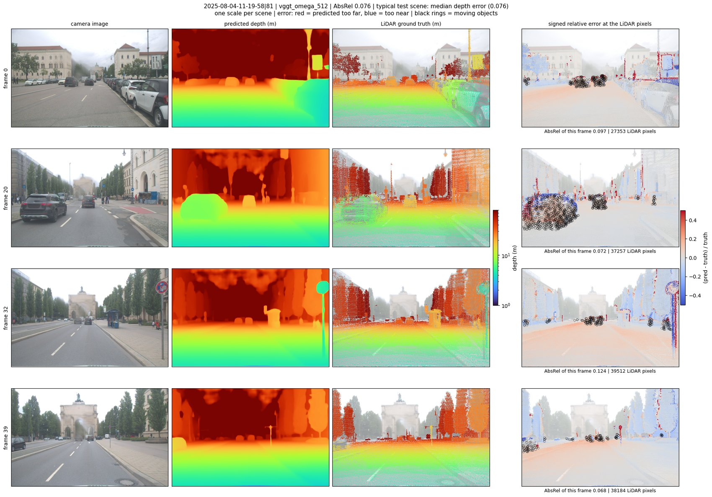

# VGGT-Ω on FZI-AURA: where a feed-forward 3D model fails on real driving data

What does the released VGGT-Ω checkpoint (`facebook/VGGT-Omega`, `vggt_omega_1b_512.pt`) do on real
driving data it cannot have seen, and where does it fail?

[FZI-AURA](https://huggingface.co/datasets/fzi-forschungszentrum-informatik/FZI-AURA) was published on
2026-09-09, after the model. It has eight cameras, up to twelve LiDARs, 3D boxes and per-point semantic
labels. That makes it possible to split depth and camera-pose error by **moving against parked objects**,
by **weather, light and road type**, and to look at single scenes when a number looks wrong.

This is a stratified failure analysis of ONE checkpoint, with the predecessor VGGT-1B as a reference. It is
**not** a test of the paper's scaling claims. Noncommercial research only (see Licences).

## Results in short

414 scenes of about 40 keyframes each were run (front camera, 1920x1200 reduced to 640x400). 20 of them, the
block every rule was tuned on, are left out of all tables. The **test split** (107 scenes, all daytime) was not
looked at until everything else was fixed. Depth error is AbsRel after ONE scale per scene (the model's depth
has no metric scale); intervals are 95% bootstrap intervals over scenes.

**1. Daytime depth is good and holds on unseen scenes.** Test split: AbsRel **0.082** (0.077 to 0.087),
δ<1.25 = 94.3%; 0.077 under the authors' per-frame scale-and-shift. Dry daytime scenes score 0.084 on the test
split and 0.081 on the scenes used during development: no sign of tuning to the data. Error grows with
distance (0.066 at 1-10 m, 0.106 at 40-80 m) and is concentrated on thin objects (0.30), people (0.27) and
vehicles (0.14); the road surface is at 0.04. The model's own confidence orders its errors well: 0.18 in the
least confident quarter of pixels, 0.035 in the most confident.

**2. Things that move are harder, and about 60% of that is the model.** Test split: background 0.077, parked
objects 0.099, moving objects **0.203**; moving is worse than parked in 78 of 89 scenes (+0.108). But LiDAR
points of an object crossing the view land a few pixels beside it in the image, which looks like a model error
along the object's outline. Counting only the INTERIOR of objects, where that cannot reach, moving is still
worse than parked by **+0.062** (0.038 to 0.096; 70 of 76 scenes), also at matched distance and for cars alone.
The rest of the gap sits on outlines and cannot be attributed.

**3. Outlines cost more than motion.** For PARKED objects, pixels within 6 px of the outline score +0.090 worse
than the interior (83 of 86 scenes): soft depth edges, plus whatever residual calibration error shifts LiDAR
points across an edge.

**4. Rain in daylight costs little; the dark, wet drives cost a lot, and part of that is the ground truth.**

| condition | scenes | recordings | AbsRel | median over scenes |
|---|---|---|---|---|
| dry, day | 148 | 35 | 0.081 | 0.075 |
| wet, day | 61 | 9 | 0.091 | 0.085 |
| wet, night | 44 | 2 | 0.159 | 0.143 |
| wet, twilight | 32 | 1 | 0.245 | 0.191 |
| dry, night | 2 | 1 | 0.121 | |

All dark scenes come from three recordings, all wet, so "darkness" and "those evenings" cannot be told apart,
and darkness without rain is two scenes. In heavy rain the LiDAR measures the spray behind vehicles as a solid
surface and returns rain drops at 1 to 3 m in the open sky; relative error divides by that small "true" depth.
One such scene reaches AbsRel 1.64 while its median signed error per frame is near zero
([picture](results/figures/03_rain_spray_in_the_lidar_ground_truth_depth.jpg)). Wet numbers are inflated by an
unknown amount; medians are given for that reason.

**5. Camera pose is excellent in daylight and fails in two recognisable ways.** Test split: rotation 0.59°,
translation direction 0.82°, AUC@30 98.0, trajectory error 1.2% of the path; no failed scene among 99.
The failures elsewhere:
- *Ego motion lost at night.* Blinded by oncoming headlights on a wet road, the predicted path follows the
  truth for about ten frames and then stalls while the car drives another 300 m
  ([image](results/figures/04_wet_night_headlight_glare_depth.jpg),
  [path](results/figures/05_wet_night_ego_motion_lost_path.jpg)).
- *Standing still, predicted as driving.* In a traffic jam the car stands for 22 frames; the model predicts
  steady forward motion, taking the moving traffic in the next lane for the static world. Depth in the same
  scene is excellent, 0.074 ([image](results/figures/06_traffic_jam_depth.jpg),
  [path](results/figures/07_traffic_jam_standing_still_predicted_as_driving_path.jpg)).

Each of the two is ONE scene looked at closely. How often: outside the test split the direction of travel
comes out reversed in 4 of 269 moving scenes. Three are on the wet night drive. The fourth is a dry daytime
urban scene with excellent depth (0.042) that has not been looked at, so not every pose failure is explained.

**6. Against its predecessor VGGT-1B** (paired by scene): on the test split VGGT-Ω has the lower depth error in
103 of 107 scenes (−0.044), a third of the error inside moving objects (0.109 against 0.332), rotation 0.59°
against 2.44° and a focal length off by −0.7% against −11%. On the hard development-side scenes the depth
advantage shrinks to a tie (−0.007, interval includes zero) while the pose advantage holds (failed scenes 4
against 14 of 269). Caveat: the two models see different input sizes (640x400 and 518x322) and are scored on
their own sets of LiDAR pixels.


*A typical test scene (median error). Columns: camera image, predicted depth, LiDAR ground truth, signed
relative error (red = predicted too far, blue = too near, black rings = moving objects).*

## What this does not show

- Scenes were chosen for rare conditions (night, rain, motorway), not sampled at random: the overall number of
  the development side (0.113) is not a dataset-wide estimate. The test split is the closest to one, for daytime.
- Intervals resample scenes. Scenes cut from one drive are not independent; tables carry the number of
  recordings so that a cell resting on one or two drives can be seen as such.
- One camera (`front_medium`), one checkpoint, one run per scene. LiDAR ground truth is sparse and says
  nothing about the sky.
- The ground-truth error bound for moving objects (object speed along the view, times the 0.1 s sweep) does not
  cover sideways motion; finding 2 is the answer to that, not the bound.
- The weather label comes from a weather service. Some "dry" scenes show water on the lens.

## Possible next steps

Not done, and not needed for the findings above:
- look at the fourth failed-pose scene (dry, daytime, urban), the only pose failure without an explanation;
- the other seven cameras, and other feed-forward 3D models scored with the same ground truth and strata;
- dark scenes WITHOUT rain: the dataset has 13, too few here to separate darkness from rain;
- intervals that resample recordings instead of scenes;
- a ground truth that drops rain spray and rain drops, so that wet scenes measure the model and not the LiDAR.

## How it is built

- **Python first, then C++.** `src/vggt_aura/` is the reference. The geometry core (projection, rigid
  transforms, LiDAR-to-image with the occlusion test) exists a second time in `cpp/`: header-only C++17, no
  dependencies, bound with pybind11, and differential-tested against Python with EXACT equality of every
  output. It builds the ground truth in the pipeline (2.2x on that step, measured on a laptop; that step is 5% of
  a scene's time, so the gain is small) and the pipeline falls back to Python when it is not built.
  [`docs/performance.md`](docs/performance.md) points to the exact lines where C++ is called and gives every
  measurement.
- **Ground truth**: motion-compensated sweeps of the six Ouster LiDARs, projected at the model's input size,
  nearest visible point per pixel, `noise` and `ego` points dropped, 1 to 80 m. The occlusion rule removes a
  point only if much nearer points lie on BOTH sides of it; a simpler window rule deleted most of the far road.
- **Protocol**: five alignments side by side (one scale per scene is primary; the authors' per-frame
  scale-and-shift is reported too); the scene is the unit; strata need 200 pixels in a scene and 5 scenes;
  comparisons are paired by scene. Predictions were written down before the first run (`docs/predictions.md`).
- **Ephemeral compute**: notebooks run on Colab from a local VS Code. Code reaches the runtime without git:
  `python -m vggt_aura.sync` packs `src/`, `cpp/` and `tests/` into a cell of every notebook. Everything is
  resumable from persistent storage: predictions, ground truth and per-block results are files, and a finished
  block is never downloaded again.
- **Speed**, all measured and result-identical: a block of 20 scenes went from 20 to 6.5 minutes on a CPU
  server (parallel scoring 4.8x, LiDAR archives decompressed on all cores 5.3x with byte-identical files,
  predictions fetched during the download), a GPU block from 5.3 to 2.1 minutes (images read in the
  background, no compression of noise-like depth, models kept loaded), and two CPU servers can share one block
  list. Each change, where it is in the code, what it saved and how it was checked: [`docs/performance.md`](docs/performance.md).
- 220 tests (`pytest`), including the dense synthetic scenes that caught a wrong occlusion rule.

## Layout

- `src/vggt_aura/`   the package: data access, ground truth, metrics, evaluation, pipeline, pictures
- `cpp/`             the C++ geometry core and its build
- `tests/`           pytest, including the Python-against-C++ differential tests
- `notebooks/`       the run itself, numbered in order: census, predict (GPU), score, report, the same for the test
                     split, error pictures, the interior-against-outline check. Saved outputs are the record of each result. `notebooks/development/` holds phases 0 to 6
                     (how the method was built), `notebooks/experiments/` the measurements behind the speed-ups.
                     See `notebooks/README.md`. Notebooks are committed with an EMPTY code cell: run
                     `python -m vggt_aura.sync` first (`--clear` empties the cells again before a commit)
- `results/figures/` selected error pictures
- `docs/decisions.md`   every finding, number and mistake with its source, in the order it happened
- `docs/performance.md` where the time went, where C++ runs, what each speed-up saved
- `docs/predictions.md` predictions registered before the results

To run the tests: `pip install -e .[dev]` and `pytest` (no dataset, no GPU needed). The Python-against-C++ tests are
skipped until the module is built with `python -m vggt_aura.cpp_build`, which needs a C++ compiler; two cross-checks
against the dataset toolkit are skipped unless `fzi-aura-sdk` is installed. To run the notebooks you need a Hugging Face token
with access to the gated checkpoint in a `.env` file (see `.env.example`), a GPU for the `*_gpu` notebooks and
about 50 GB of persistent storage for predictions and ground truth.

## Running it again

1. `python -m vggt_aura.sync` in the project folder: puts the current code into every notebook's sync cell and
   prints its **code hash** (first 12 hex digits of the SHA-256 of the zipped `src/`, `cpp/`, `tests/` and
   `pyproject.toml`; it identifies a code version and contains nothing else).
2. Run the notebooks in order (`notebooks/README.md`). Every session appends one line to `provenance.jsonl` in
   persistent storage: that code hash, the pinned dataset revision, the pinned model code and weights, package
   versions, the GPU. So for every result there is a text record of what produced it.
3. Finished work is skipped: predictions, ground truth and block results are files. To recompute the scores from the
   saved predictions, change `RUN_TAG`. To redo everything from the images up, start the session in an empty folder:
   `start_session(drive_root="/content/drive/MyDrive/<new folder>")`, with a copy of the `.env` in it.

What to expect from a repeat, measured: one block (val 12, 7 scenes) was run again from an EMPTY folder a day after
the published run, and compared with it (`notebooks/experiments/rerun_check_2_score_and_compare.ipynb`). Both models'
predicted depth was **bit-identical** in 7 of 7 scenes, the ground truth built again from LiDAR was identical in 7 of 7,
and all 1,155 rows of the result files agreed exactly (largest difference in AbsRel, delta and RMSE: 0). Both runs were on
an A100 (40 GB) with the same package versions; another GPU type or another PyTorch version may change the last digits,
which was not tried. Dataset, toolkit, model code and weights are pinned by commit in `src/vggt_aura/pins.py`.

## Licences, attribution and restrictions

- **Model.** VGGT-Ω is under the FAIR Noncommercial Research License. All outputs and results in this repo are
  for noncommercial research use only. Weights are never committed. The comparison model `facebook/VGGT-1B` is
  under CC BY-NC 4.0.
- **Data.** FZI-AURA, CC BY-SA 4.0, FZI Forschungszentrum Informatik. Faces and licence plates are anonymised
  by the dataset's authors. The pictures in `results/figures/` and the pictures inside the notebooks' saved
  outputs show AURA imagery, are adaptations of it and are shared under CC BY-SA 4.0.
- **Road metadata** (`road_type`, used to split results) is derived from OpenStreetMap data. Copyright
  OpenStreetMap contributors, Open Data Commons Open Database License 1.0,
  https://www.openstreetmap.org/copyright/
- **Weather metadata** (used to split results): Weather data provided by OpenWeather,
  https://openweathermap.org/ . Weather content under CC BY-SA 4.0, database rights under ODbL 1.0. No
  endorsement by OpenWeather is implied. The dataset's `THIRD_PARTY_NOTICES.MD` has the full notices.
- **Dataset toolkit.** `fzi-aura-sdk`, Apache License 2.0.
- **This repo's own code** (`src/`, `cpp/`, `tests/`, the notebooks' code cells): MIT, see `LICENSE`. That covers the code
  only. It does not loosen anything above: results and pictures made with VGGT-Omega stay noncommercial, and pictures
  showing AURA imagery stay CC BY-SA 4.0.

## Citation of what this work builds on

```bibtex
@misc{polley_fzi_aura_2026,
  author    = {Polley, Rupert and Heinrich, Marc and Sch{\"o}rner, Philip and Uecker, Marc and Ochs, Sven and
               Fleck, Tobias and Zofka, Marc Ren{\'e} and Z{\"o}llner, J. Marius},
  title     = {{FZI-AURA: A Multimodal Autonomous Driving Dataset}},
  year      = {2026},
  version   = {1.0.0},
  publisher = {FZI Forschungszentrum Informatik},
  url       = {https://huggingface.co/datasets/fzi-forschungszentrum-informatik/FZI-AURA}
}

@misc{wang2026vggtomega,
  title  = {VGGT-$\Omega$},
  author = {Jianyuan Wang and Minghao Chen and Shangzhan Zhang and Nikita Karaev and Johannes Sch{\"o}nberger and
            Patrick Labatut and Piotr Bojanowski and David Novotny and Andrea Vedaldi and Christian Rupprecht},
  year   = {2026},
  eprint = {2605.15195},
  archivePrefix = {arXiv}
}
```
